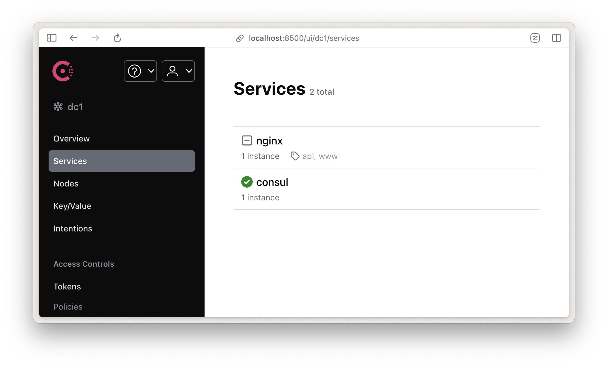
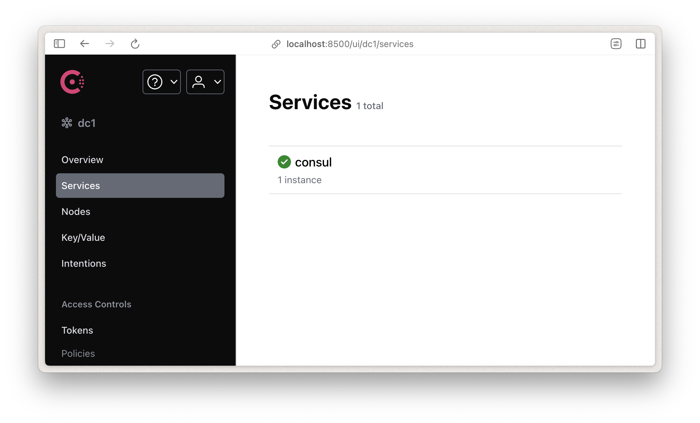

# Container-to-Consul


Container-to-Consul automatically registers and deregisters containers as services in Consul.

This project is largely based on the original work done in [con-tainer2sul](https://github.com/benoitvidis/con-tainer2sul) by [Benoît Vidis](https://github.com/benoitvidis/). While this fork includes significant changes and improvements, we would like to acknowledge the foundation provided by the original project, without which this version would not have been possible.

Please note that some files, variables, or other elements might still reference the original project name. These remnants will be updated over time as the project evolves, but their presence reflects the project's roots as con-tainer2sul.

<!-- toc -->

- [Container-to-Consul](#container-to-consul)
  - [Running Container-to-Consul from source](#running-container-to-consul-from-source)
  - [Configuration](#configuration)
      - [Consul](#consul)
      - [Docker](#docker)
      - [Logger](#logger)
  - [Container registration](#container-registration)
    - [Supported labels](#supported-labels)
    - [Registration](#registration)
    - [Deregistration](#deregistration)
  - [Running E2E tests](#running-e2e-tests)

<!-- tocstop -->

## Running Container-to-Consul from source

We provide a Docker Compose setup with [Consul](https://developer.hashicorp.com/consul) included. To run the project, you can use the following command:
```
docker compose up -d --build --force-recreate
```

## Configuration

Container-to-Consul uses [rc](https://www.npmjs.com/package/rc) to import its configuration.

The configuration can be overridden using any method supported by rc, for instance using a custom `.c2crc` file or by defining some environmental variables prefixed by `c2c_`.

#### Consul

Consul `host` and `port` can be configured:

_.c2crc_
```json
{
  "consul": {
    "host": "localhost",
    "port": 8500
  },
  "[..]": "[..]"
}
```

#### Docker

The `docker` section of the configuration is given to [dockerode](https://github.com/apocas/dockerode) constructor.

Please refer to [dockerode](https://github.com/apocas/dockerode) documentation for supported options.

Default configuration listens to Docker daemon on `/var/run/docker.sock` unix socket.

_.c2crc_
```json
{
  "[..]": "[..]",
  "docker": {
    "socketPath": "/var/run/docker.sock"
  }
}
```

#### Logger

Container-to-Consul uses [bunyan](https://github.com/trentm/node-bunyan). The `logger` section of the configuraton object is passed to `bunyan.createLogger` method.

Default configuration outputs logs at `info` level to `stdout`.

_.c2crc_
```json
{
  "[..]": "[..]",
  "logger": {
    "name": "container-to-consul"
  }
}
```


## Container registration

Container-to-Consul relies on [Docker labels](https://docs.docker.com/engine/userguide/labels-custom-metadata/) to define the values sent to Consul.

Internally, Container-to-Consul calls Consul low-level [catalog/register](https://www.consul.io/docs/agent/http/catalog.html#catalog_register) and [catalog/deregister](https://www.consul.io/docs/agent/http/catalog.html#catalog_deregister) API endpoints.

Container registration is an opt-in process. By default, Container-to-Consul will not register any container in Consul. To register a container the `consul.register` label must be set to `true`.

### Supported labels

| Label | Description | Default |
| --- | --- | --- |
| `consul.register` | Marks a container for discovery | `false` |
| `consul.ip` | The IP that will be registered as part of the service in Consul| first IP found in the `NetworkSettings` group from `docker inspect` result. If the container is running in `host` network mode, the ip address used is the `docker0` one. |
| `consul.port` | The port that the service will be discovered on| `none` |
| `consul.service` | The name of the service in Consul | `container name` |
| `consul.tags` | The tags that will be added to the service in Consul | `[]` |
| `consul.meta` | The service [meta](https://developer.hashicorp.com/consul/api-docs/catalog#meta) as `key=value,key=value` | empty |
| `consul.kv.<KEY>` | Key/Value pairs | `{}` |

### Registration
Running;

```
docker run --name nginx -d \
 -l consul.register=true \
  -l consul.ip=10.0.0.1 \
   -l consul.service=nginx \
    -l consul.tags=www,api \
     -l consul.port=80 \
      -l consul.kv.foo=bar \
       -l consul.kv.bar=baz \
        nginx
```

will register a service named `nginx` with
- ip  `10.0.0.1`
- tags `www` and `api`
- port `80`
- 2 key/value pairs under the `/services/nginx/` tree.

You can check for the registered service in [Consul](http://localhost:8500/ui/dc1/services)



> For a complete usage example please [see](https://github.com/mekomsolutions/container-to-consul/blob/main/e2e/docker/docker-compose.yaml).

### Deregistration

To deregister the container, you can simply stop it.

```bash
docker stop nginx
```

After this if you check [Consul](http://localhost:8500/ui/dc1/services) the service will be removed



You can then remove the container

```bash
docker rm nginx
```

**Note** : At the moment using force (`-f`) when removing a container will not deregister the service

## Running E2E tests

The project contains E2E tests written with [Playwright](https://playwright.dev/) and [Dockerode](https://github.com/apocas/dockerode). Any changes made to the project should be accompanied by E2E tests. To run the tests, you need to have Docker installed and running. Then, you can run the following command:

```
docker compose -f docker-compose-e2e.yaml -p container-to-consul-e2e up --build --force-recreate --abort-on-container-exit --exit-code-from playwright
```
